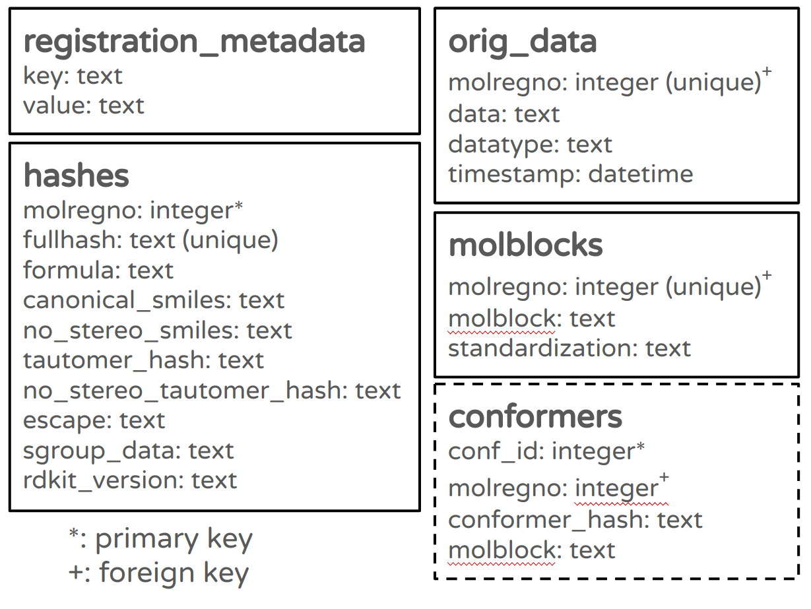
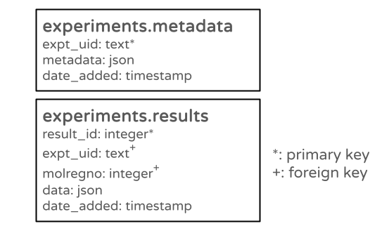
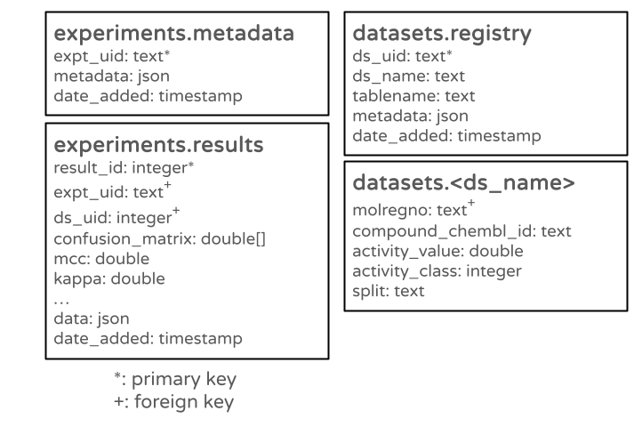

# lwreg Database Layout

lwreg uses four database tables (five in `registerConformers` mode):

- `registration_metadata` - Stores metadata about this installation of lwreg. This metadata includes things like the RDKit version used, the database configuration, etc.
- `hashes` - Defines molregnos and stores the associated molecular hashes as well as all of the hash layers 
- `orig_data` - Connects molregnos to registered structures. The structures are stored in whatever format they were provided (SMILES, Mol block, or RDKit molecule) along with a column indicating what that format was. Has an additional column storing a timestamp for when each structure was registered.
- `molblocks` - Connects molregnos to molecular structures, which are stored as V3000 mol blocks. Has an additional column tracking which standardization operations were applied to a molecule.
- `conformers` - Only present in `registerConformers` mode, connects conformer hashes to molregnos and stores the registered conformers as V3000 mol blocks.  

# A simplified schema for storing experimental metadata and data

The easiest way to track experimental metadata (information about how to reproduce the experiments) and the data from the experiments is to capture the information in python dictionaries and insert those into the database as JSON.

*Note:* When using PostgreSQL as the database, it is more efficient to store the `metadata` and `data` columns as `jsonb` instead of `json`.

A simple example of using this schema is in the notebook `demos/02_computational_experiment_1.ipynb`.

When the situation allows it and you have a good idea of what types of metadata or data you will be capturing, it's worth creating a more compex schema that is more explicit about the information being stored (i.e. storing column names and types).  

The notebook `tutorial/Machine learning experiment,ipynb` has an example with a more complex schema that partially models the data being used instead of just using JSON. Here's a view of that schema:

